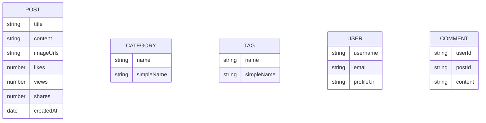

# Tagify

A robust backend CMS(Content Management System)API for a modern blog platform with categories, tags, and advanced filtering. Built with Node.js, Express, and MongoDB.

## Features ✨

### Core Functionalities

- **Post Management**:
  - Create post
  - Get all posts
  - Get posts by their id
  - Update post
  - Delete post
  - View post
  - Like post
  - Dislike post
  - Get posts by respective categories
  - Get posts by respective tags
  - Get User's all posts
  - Search post based on title
  - Get latest posts
  - Get trending posts
  - Get posts by date
  - Get posts by popularity
  - Get posts by views
  - Get posts by likes
  - Get posts by dislikes
  - Get posts by share
- **Category System**: Each post belongs to certain category
  - CRUD operation on categories
- **Tagging Engine**: Flexible many-to-many tagging
  - CRUD operation on tags
- **Comments**: One user can comment on own or other's posts
- CRUD operation on commnets

### Advanced Features

- **Full-text search**
- **Post Analytics Dashboard**
- **Trending tags and categories**
- **MongoDB index optimization**
- **Recommendation engine**
- **User contribution stats**

### Performance Optimizations

- MongoDB indexing for all query patterns
- Lean queries with selective field population
- Aggregation pipelines

## Database Schema

## API Endpoints

- **User**

## Server is live at

- [https://tagify.onrender.com](https://tagify.onrender.com)

## License

This project is licensed under the MIT License - see the [LICENSE](./LICENSE) file for details.
