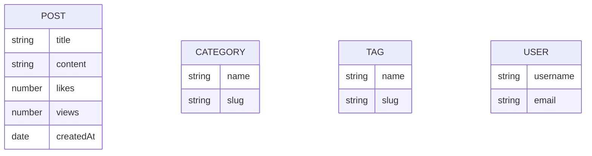

# Tagify

A robust backend API for a modern blog platform with categories, tags, and advanced filtering. Built with Node.js, Express, and MongoDB.

## Features ✨

### Core Functionalities
- **Post Management**: Full CRUD for blog posts
- **Category System**: Organize posts hierarchically
- **Tagging Engine**: Flexible many-to-many tagging
- **Engagement Metrics**: Likes, views, and shares tracking

### Advanced Features
- 🔍 **Full-text search** across titles and content
- 📊 **Analytics Endpoints**: Trending posts, popularity metrics
- ⏱ **Time-based Filtering**: Daily/weekly/monthly views
- 📱 **Pagination & Sorting**: Limit, skip, and custom sorts

### Performance Optimizations
- MongoDB indexing for all query patterns
- Lean queries with selective field population
- Cached aggregation pipelines

## Database Schema

## Server is live at
- [https://tagify.onrender.com](https://tagify.onrender.com)

## License

This project is licensed under the MIT License - see the [LICENSE](./LICENSE) file for details.
